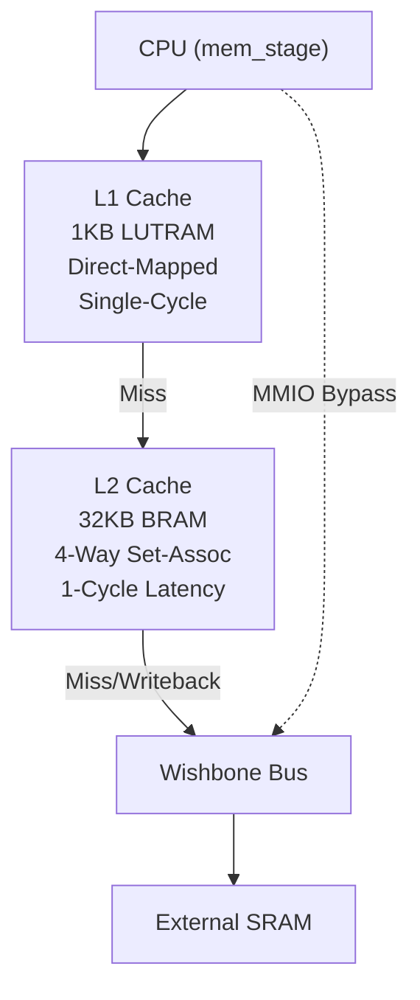

# Two-Level DCache Implementation Plan

Implement a high-performance two-level data cache for the RISC-V CPU with Write-Back strategy.

> [!IMPORTANT]
> **增量开发策略**: 分5个阶段实现，每阶段完成后验证，确保稳定后再进入下一阶段。

## 增量实现路线图


---

## Phase 1: L1 只读缓存 (Read-Only)

**目标**: 实现最简单的 L1 缓存，只处理读操作，写操作仍然 bypass。

**新增功能**:
- L1 存储结构 (LUTRAM)
- 读命中检测 (组合逻辑)
- 读未命中时从内存加载 cache line
- 写操作保持 bypass (不动)

**验证测试**:
```c
// test_phase1.c - 只测试读操作
volatile int *p = (volatile int*)0x80002000;
int a = p[0];  // Cold miss, load from memory
int b = p[0];  // L1 hit (same line)
int c = p[1];  // L1 hit (same line, word offset 1)
// 验证: a == b == c (if memory initialized)
```

---

## Phase 2: L1 Write-Through

**目标**: 添加写命中更新缓存的能力，但同时写穿到内存。

**新增功能**:
- 写命中时更新 L1 数据
- 同时写穿到内存 (通过 Wishbone)
- 写未命中时只写内存 (no write-allocate)

**验证测试**:
```c
// test_phase2.c - 测试写穿透
volatile int *p = (volatile int*)0x80002000;
p[0] = 0x12345678;  // Write to memory (miss, bypass)
int a = p[0];       // Load into L1
p[0] = 0xDEADBEEF;  // Write-through (update L1 + memory)
int b = p[0];       // L1 hit
// 验证: b == 0xDEADBEEF
```

---

## Phase 3: L1 Write-Back (单层缓存完整功能)

**目标**: 将 L1 改为 Write-Back 策略，添加 dirty bit。

**新增功能**:
- Dirty bit 追踪
- 写命中只更新 L1，设置 dirty=1
- 写未命中时 write-allocate (先加载再写)
- Eviction 时如果 dirty，写回内存

**验证测试** (使用已有的 writeback_test.c):
```c
// 写入地址 A
base[0] = 0xCAFEBABE;
// 访问冲突地址触发 eviction
evict_addr[0] = 0x12345678;
// 读回地址 A (应该从内存读回写回的数据)
int val = base[0];
// 验证: val == 0xCAFEBABE
```

---

## Phase 4: 添加 L2 缓存 (Read-Only)

**目标**: 在 L1 之下添加 L2 缓存，先只处理读操作。

**新增功能**:
- L2 存储结构 (BRAM, 4-way)
- L2 标签比较和命中检测
- L1 miss → L2 lookup → L2 hit/miss
- L2 LRU 替换策略

**验证测试**:
```c
// 访问超过 L1 容量但在 L2 容量内的数据
for (int i = 0; i < 2048; i += 16) {  // 超过 L1 1KB
    volatile int *p = (volatile int*)(0x80002000 + i);
    int val = *p;  // 一些会在 L1 miss，但 L2 hit
}
```

---

## Phase 5: 完整 Two-Level Write-Back

**目标**: 完成完整的两级 Write-Back 缓存。

**新增功能**:
- L1 eviction → 写入 L2 (如果 dirty)
- L2 dirty bit 追踪
- L2 eviction → 写回内存 (如果 dirty)
- 完整的 FSM

**验证测试**: 运行所有已有测试，确保功能正确。

---

## Architecture Overview



## Cache Parameters

| Parameter | L1 Cache | L2 Cache |
|-----------|----------|----------|
| Size | 1KB | 32KB |
| Associativity | Direct-Mapped | 4-Way |
| Line Size | 16 bytes (4 words) | 16 bytes (4 words) |
| Sets | 64 | 512 |
| RAM Type | LUTRAM (distributed) | BRAM (block) |
| Hit Latency | 0 cycles (combinational) | 1 cycle (BRAM read) |
| Tag Width | 22 bits | 19 bits |
| Index Width | 6 bits | 9 bits |
| Offset Width | 4 bits | 4 bits |

### Address Breakdown (32-bit address)
```
L1: [31:10] Tag (22b) | [9:4] Index (6b) | [3:2] Word (2b) | [1:0] Byte (2b)
L2: [31:13] Tag (19b) | [12:4] Index (9b) | [3:2] Word (2b) | [1:0] Byte (2b)
```

## Proposed Changes

### Cache Module

#### [MODIFY] [dcache.sv](file:///D:/sqw/code/verilogtest/riscv/riscv.srcs/dcache.sv)

Complete rewrite of the dcache module with:

1. **L1 Cache Storage (LUTRAM)**
   ```systemverilog
   (* ram_style = "distributed" *) logic [127:0] l1_data [63:0];  // 64 sets × 16B
   (* ram_style = "distributed" *) logic [21:0]  l1_tag  [63:0];  // 22-bit tags
   logic l1_valid [63:0];
   logic l1_dirty [63:0];
   ```

2. **L2 Cache Storage (BRAM)**
   ```systemverilog
   (* ram_style = "block" *) logic [127:0] l2_data_way0 [511:0];
   (* ram_style = "block" *) logic [127:0] l2_data_way1 [511:0];
   (* ram_style = "block" *) logic [127:0] l2_data_way2 [511:0];
   (* ram_style = "block" *) logic [127:0] l2_data_way3 [511:0];
   
   (* ram_style = "block" *) logic [18:0] l2_tag_way0 [511:0];
   // ... similar for other ways
   
   logic l2_valid [3:0][511:0];
   logic l2_dirty [3:0][511:0];
   logic [1:0] l2_lru [3:0][511:0];
   ```

3. **State Machine**
   ```systemverilog
   typedef enum logic [3:0] {
       IDLE,           // Check L1
       L2_LOOKUP,      // L1 miss, check L2 (wait for BRAM read)
       L2_HIT,         // L2 hit, fill L1
       L2_WRITEBACK,   // L2 miss, dirty line writeback
       L2_REFILL,      // Fetch from memory (4 beats)
       WRITE_DONE,     // Write completion
       BYPASS_READ,    // MMIO bypass read
       BYPASS_WRITE    // MMIO bypass write
   } state_t;
   ```

4. **Cache Operation Flow**

   **Read Hit (L1)**: 0 cycles - combinational path
   ```
   IDLE: L1 hit → return data immediately, ready_o=1
   ```

   **Read Hit (L2)**: 2 cycles
   ```
   IDLE: L1 miss → L2_LOOKUP (start BRAM read)
   L2_LOOKUP: Wait for BRAM → check tags
   L2_HIT: L2 hit → fill L1, return data, ready_o=1
   ```

   **Read Miss**: ~10+ cycles (depends on memory latency)
   ```
   IDLE → L2_LOOKUP → L2_WRITEBACK (if dirty) → L2_REFILL → L2_HIT → IDLE
   ```

   **Write Hit (L1)**: 0 cycles
   ```
   IDLE: L1 hit → update L1 data, set dirty, ready_o=1
   ```

   **Write Miss**: Fill first, then write (write-allocate)
   ```
   Same as read miss, then write to L1
   ```

5. **Write-Back Logic**
   - On L1→L2 eviction: If L1 dirty, write to L2, propagate dirty bit
   - On L2 eviction (to memory): If L2 dirty, write 4 words via Wishbone
   - Byte-enable (mem_req_be_i) applied to cache line for partial writes

6. **MMIO Bypass** (preserved from current implementation)
   ```systemverilog
   wire is_cacheable = (mem_req_addr_i[31:23] == 9'b1000_0000_0); // 0x80000000~0x807FFFFF
   wire is_bypass = !is_cacheable && !is_magic_addr;
   ```

## Interface (Unchanged)

The CPU interface and Wishbone interface remain the same as current implementation:

```systemverilog
// CPU Interface (from mem_stage)
input  logic [31:0] mem_req_addr_i,
input  logic [31:0] mem_req_wdata_i,
input  logic        mem_req_we_i,
input  logic [3:0]  mem_req_be_i,
input  logic        mem_req_valid_i,
output logic [31:0] mem_resp_data_o,
output logic        mem_req_ready_o,

// Wishbone Master Interface (to SRAM)
output logic [31:0] wb_adr_o,
output logic [31:0] wb_dat_o,
input  logic [31:0] wb_dat_i,
output logic        wb_we_o,
output logic [3:0]  wb_sel_o,
output logic        wb_stb_o,
input  logic        wb_ack_i,
output logic        wb_cyc_o,
input  logic        wb_rty_i,
input  logic        wb_err_i
```

## Key Design Decisions

> [!IMPORTANT]
> **Write-Allocate Policy**: On write miss, we first fetch the cache line from memory, then write to it. This simplifies partial-word writes (lb/sb/lh/sh).

> [!NOTE]
> **L1→L2 Inclusive**: L2 is inclusive of L1. Every line in L1 also exists in L2. This simplifies coherence: eviction from L1 only needs to update L2's dirty bit.

> [!WARNING]
> **Byte-Enable Handling**: For partial writes, we must read-modify-write the cache line. The current implementation accumulates 4 words during refill, we apply byte-enable when writing data.

## Verification Plan

### Automated Tests

1. **Compile the new dcache module**
   ```powershell
   cd D:\sqw\code\verilogtest\riscv\riscv.srcs
   iverilog -g 2012 -D SIMU -o sim.vvp -s testbench *.sv *.v
   ```

2. **Run existing writeback test**
   ```powershell
   # First compile the test program
   cd D:\sqw\code\verilogtest\riscv\test
   # Copy the pre-built test binary
   copy writeback_test.bin ..\riscv.srcs\kernel.bin
   
   # Run simulation
   cd D:\sqw\code\verilogtest\riscv\riscv.srcs
   vvp -n sim.vvp
   ```
   
   **Expected Output**: 
   ```
   === Writeback Test ===
   Step 1: Write to address A...
   Step 2: Access same set to trigger eviction...
   Step 3: Read back original address A...
   PASS: Writeback successful!
   ```

3. **Run comprehensive cache test**
   ```powershell
   cd D:\sqw\code\verilogtest\riscv\test
   copy comprehensive_cache_test.bin ..\riscv.srcs\kernel.bin
   cd D:\sqw\code\verilogtest\riscv\riscv.srcs
   vvp -n sim.vvp
   ```

### Manual Verification

After implementation, please verify:
1. The simulation completes without hanging (indicates FSM works correctly)
2. The test output shows "PASS" messages
3. No X/Z values observed in cache data paths (if using waveform viewer)
